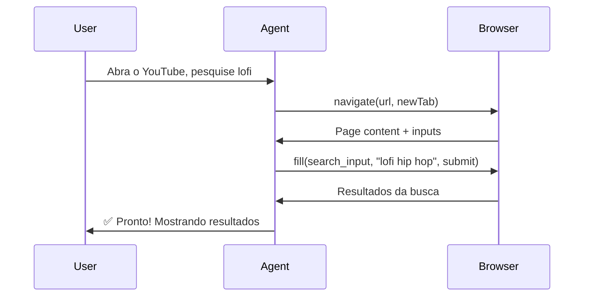
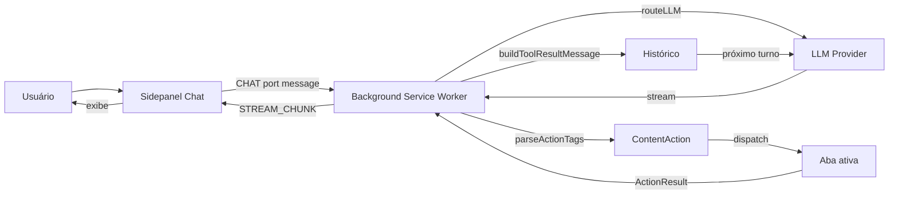

# AI Browser Agent

Extensão para Chrome/Chromium que usa LLMs (Large Language Models) para **automatizar tarefas no navegador** — preencher formulários, navegar, pesquisar, clicar, extrair dados e muito mais. Tudo via linguagem natural.


---

## Funcionalidades

| Funcionalidade | Descrição |
|---------------|-----------|
| **🤖 Automação por linguagem natural** | Peça em português, inglês, etc. O agente lê a página e executa ações |
| **📸 Upload de imagens e PDFs** | Anexe prints ou documentos para o agente analisar e agir |
| **🔄 Múltiplos providers** | OpenAI, Anthropic (Claude), Google Gemini, OpenRouter, Groq, DeepSeek, Ollama |
| **🛡️ Fallback automático** | Configure providers reserva caso o principal falhe |
| **👤 Alma do agente** | Customize personalidade, tom e idioma |
| **📑 Scraping inteligente** | Extraia links, tabelas, listas e metadados |
| **📷 Screenshot sob demanda** | Capture visualmente a página quando texto não basta |
| **📂 Abas agrupadas** | Abas abertas pelo agente são organizadas em grupo "AI Agent" |

---

## Screenshots

### Chat com steps de navegação


### Configuração de providers


### Alma do agente (customização)


---

## Quick Start

### 1. Instalação

```bash
git clone <repo-url> ai-browser-agent
cd ai-browser-agent
npm install
```

### 2. Build

```bash
npm run build
```

### 3. Carregar no Chrome

1. Acesse `chrome://extensions/`
2. Ative **"Modo do desenvolvedor"**
3. Clique **"Carregar sem compactação"**
4. Selecione a pasta `dist/`

### 4. Configurar Provider

Clique no ícone da extensão na barra de ferramentas → aba **Providers**:


| Provider | API Key | Modelo sugerido |
|----------|---------|----------------|
| **OpenAI** | `sk-...` | `gpt-4o` |
| **Anthropic** | `sk-ant-...` | `claude-sonnet-4-6` |
| **Google Gemini** | `AIza...` | `gemini-2.0-flash` |
| **Groq** | `gsk_...` | `llama-3.3-70b-versatile` |
| **OpenRouter** | `sk-or-...` | `anthropic/claude-sonnet-4-6` |
| **DeepSeek** | `sk-...` | `deepseek-chat` |
| **Ollama** | *(nenhuma)* | `llama3.2` |

### 5. Usar

Abra o sidepanel (clique no ícone da extensão) e converse:


---

## Exemplos de Uso

### Automação de formulários

> "Preencha o formulário de contato com nome João, email joao@teste.com e mensagem 'Olá, gostaria de saber mais'"

O agente lê a página, identifica os campos pelo seletor exato e preenche.

### Pesquisa na web

> "Pesquise sobre inteligência artificial"

O agente abre uma nova aba no Google, faz a busca e retorna os resultados.

### Navegação multi-etapas

> "Abra o YouTube, pesquise por 'lofi hip hop' e clique no primeiro vídeo"



### Trabalhar com prints/anexos

> *(anexa print de um formulário)* "Preencha o formulário na tela igual a este print"

O agente vê a imagem, entende a estrutura do formulário e replica no site real.

---

## Providers: Fallback

Na aba de chat, clique no ícone 🔀 para configurar fallbacks:


Se o provider principal falhar (timeout, rate limit, erro), o sistema tenta automaticamente o próximo da lista.

---

## Arquitetura

```
src/
├── manifest.json            # Manifesto MV3
├── background/
│   ├── index.ts             # Service worker: agentic loop, dispatch de ações
│   └── llm/
│       ├── router.ts        # Roteamento para o provider correto
│       └── providers/       # Implementações de cada provider
│           ├── openai.ts
│           ├── anthropic.ts
│           ├── gemini.ts
│           ├── openrouter.ts
│           ├── deepseek.ts
│           ├── groq.ts       # (usa streamOpenAI com formato groq)
│           ├── ollama.ts
│           └── opencode.ts
├── content/
│   ├── index.ts             # Content script: message listener
│   └── actions/
│       ├── reader.ts        # Leitura de página + elementos interativos
│       ├── clicker.ts       # Clique por seletor/texto/aria-label
│       ├── filler.ts        # Preenchimento de formulários
│       ├── navigator.ts     # Navegação, scroll
│       └── scraper.ts       # Scraping de dados
├── sidepanel/
│   ├── App.tsx              # UI principal com abas
│   ├── views/
│   │   ├── Chat.tsx         # Chat com streaming + upload de arquivos
│   │   ├── Providers.tsx    # Gerenciamento de providers
│   │   └── Soul.tsx         # Personalidade do agente
│   └── components/
│       ├── ChatMessage.tsx  # Bolha de mensagem com steps + files
│       ├── ModelSelector.tsx
│       └── ProviderCard.tsx
└── shared/
    ├── types.ts             # Tipos compartilhados
    ├── constants.ts         # Providers built-in, tool instructions
    ├── utils.ts             # Parsing de actions, buildMessageContent
    ├── store.ts             # Persistência chrome.storage.local
    └── stream.ts            # SSE/JSON line streaming
```

### Fluxo de uma requisição



---

## Scripts

| Comando | Descrição |
|---------|-----------|
| `npm run dev` | Build + watch para desenvolvimento |
| `npm run build` | Build de produção |
| `npm run typecheck` | Validação TypeScript |
| `npm run lint` | Lint via ESLint |
| `npm run test` | Testes unitários (Vitest) |

---

## Licença

MIT
